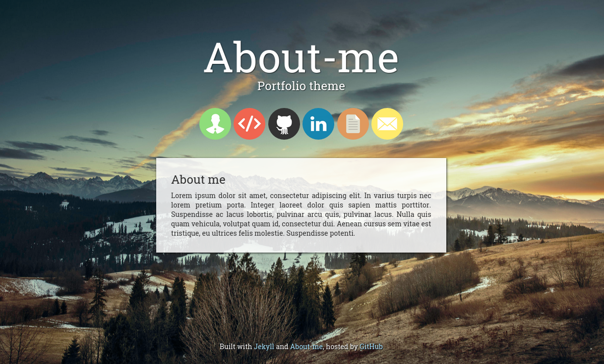
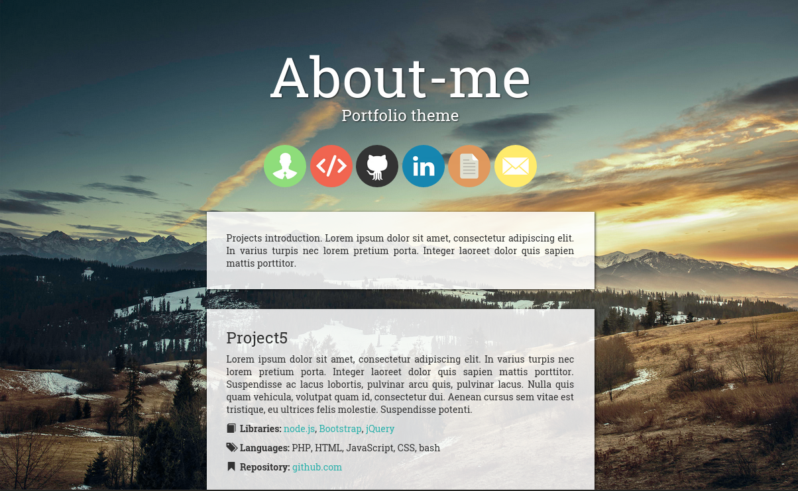

# About-me

Personal portfolio theme for jekyll.

## [Demo](http://jsidrach.github.io/jekyll-about-me/)

Features:

- customizable top circle bar
- projects page with pagination
- bootstrap components
- custom scroll
- responsive design

## Screenshots

## Installation

- [Fork this repository](https://github.com/jsidrach/jekyll-about-me/fork)
- Clone it: `git clone https://github.com/YOUR-USERNAME/jekyll-about-me`
- Change path to the cloned repository
- Install the [GitHub Pages gem](https://pages.github.com/) (includes Jekyll): `bundle install`
- Edit (at least) the required configuration files (see Customization section)
- Run the jekyll server: `jekyll serve`

## Customization

Edit these files before using:

* _config.yml REQUIRED
* _data/circlebar.yml - set top bar links
* index.html - write something about you
* _includes/projects-intro.html - projects page introduction
* projects/ - here you can share some of your projects
* favicon.ico change it or leave the existing one

## Contribute
Pull Requests always welcome.

## References

List of repositories and webpages this template is based on:

* [Autm-rb](https://github.com/railsr/autm-rb)
* [xPaw](https://xpaw.me)
* [Scrollator](https://github.com/FaroeMedia/scrollator)

## Assets

List of assets used in this template:

* [Background image](https://flic.kr/p/uc6ai8)
* Top bar icons (modified):
    * [About me](https://www.iconfinder.com/icons/532766/account_consultant_gear_profile_specialist_support_user_icon)
    * [Projects](https://www.iconfinder.com/icons/353838/code_html_web_icon)
    * [GitHub](https://www.iconfinder.com/icons/107105/github_square_icon)
    * [LinkedIn](https://www.iconfinder.com/icons/294706/circle_linkedin_icon)
    * [CV](https://www.iconfinder.com/icons/299090/file_word_icon)
    * [Mail](https://www.iconfinder.com/icons/287559/mail_icon)
* [CV example](http://www.workandincome.govt.nz/documents/brochures/example-of-skills-focussed-cv.pdf)

## Licensing

[MIT](LICENSE) - Feel free to use and edit.
